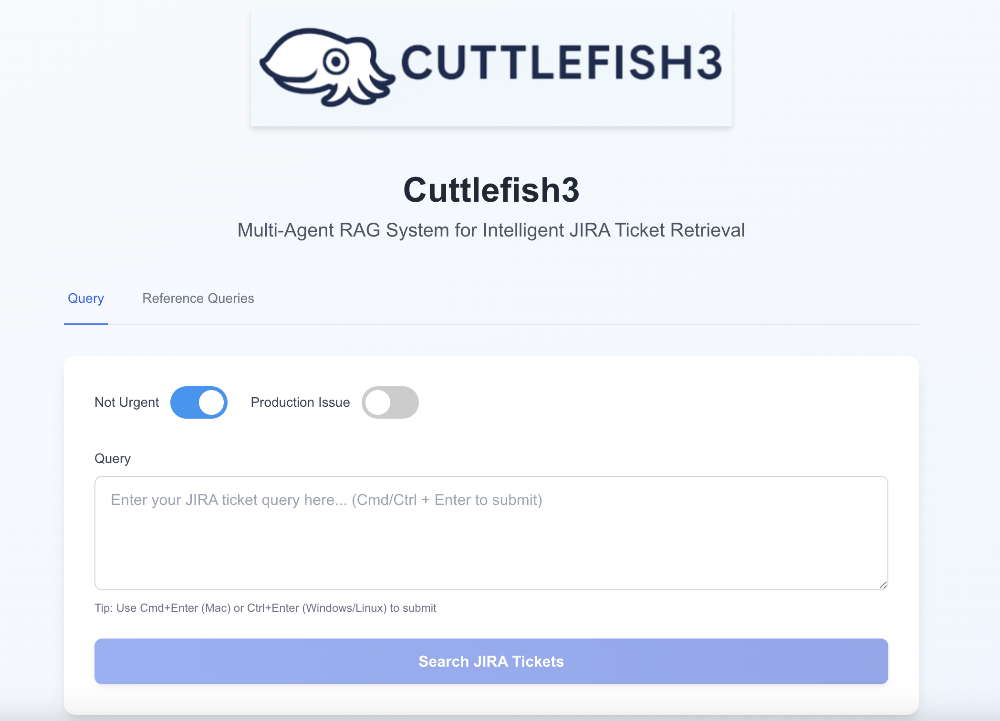
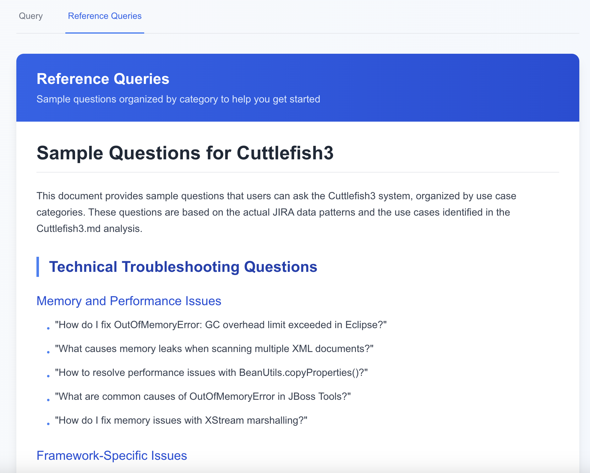
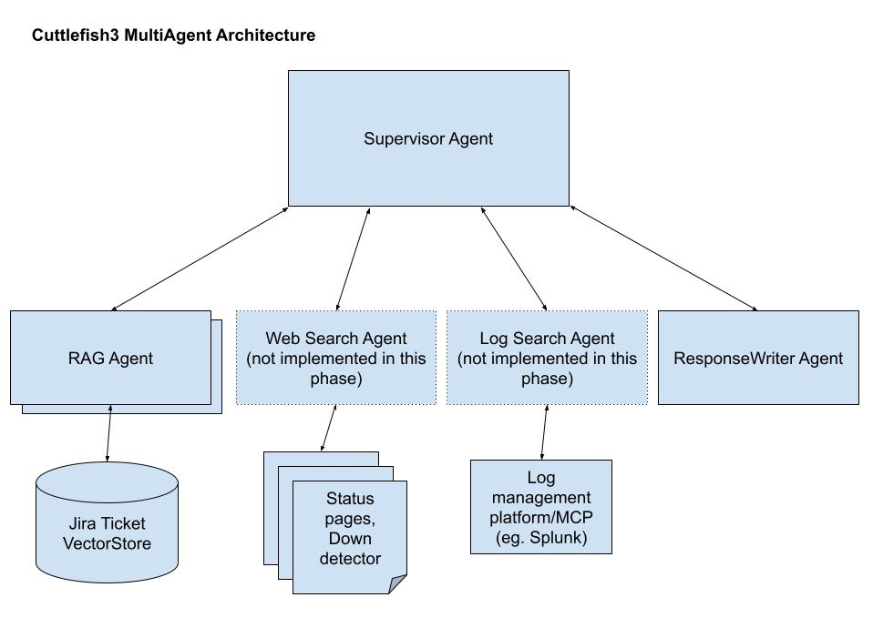

# Cuttlefish 3 

## Background
This is the 3rd revision of the tool that started with [Octopus 2](https://medium.com/gitconnected/building-a-deployable-jira-bug-classification-engine-using-tensorflow-745667c72607) - an attempt to build a bug classification engine using Tensorflow back in 2020. This led to [Cuttlefish 1](https://medium.com/data-science/building-a-deployable-jira-bug-similarity-engine-using-word-embedding-and-cosine-similarity-1c78eeb23a8d) where I used the (a) Word2Vec embedding generated by AWS's BlazingText and (b) Cosine Similarity to build a Bug similarity engine. In [Cuttlefish 2](https://medium.com/@heemeng/cuttlefish2-jira-bug-similarity-search-and-rag-1bde273d2238), I rebuilt the system using a simple Naive RAG. 

In Cuttlefish 3, this iteration of the tool, I plan to do the following:

1. Perform RAG evaluation using RAGAS to understand which types of queries work best for which retrieval methods and also chunking methods
2. Build a multi agent system to (a) figure out what query works best for which RAG or search agent (b) RAG or search agent team

## Problem Description

### 1 sentence description

A query platform for Jira tickets and other operations related queries eg. incident troubleshooting

### 2 paragraph description 
Jira tickets are a source of organizational memory especially for companies who have been operating for a significant amount of time. It captures:

1. Problems customers have faced in the past
2. Release notes (some teams document the releases as Jira tickets)
3. How bugs were fixed 
4. How customers issues were resolved
5. Known (unfixed) bugs in the system

However, even with JQL (Jira Query Language) getting to answer such queries is challenging. Atlassian has [AI tools](https://youtu.be/yd5_-wqCGUE) too but it looks very cumbersome and seems to require some kind of workflow. The objective of this tool is to enable individual teams to build up their own RAG of the Jira projects they want to index and query instead of depending on IT to set up the Atlassian tool chain and be forced into a workflow. 

### Use cases

I got Claude to perform an [analysis](AnalysisOfData.md) of the open source bug data as described in the Cuttlefish 2 article and these are the use cases it came up with:

##### **Technical Troubleshooting Questions**
- "How do I fix memory leaks in Xerces-C++ when scanning multiple XML documents?"
- "What causes 'xwork does not support the VFS of jboss-6.0Final' errors?"
- "How to resolve ClassCastException issues with SAXParserFactory?"

##### **Bug Pattern Recognition**
- "What are common causes of Maven archetype generation failures?"
- "Show me all Hibernate lazy loading issues and their solutions"
- "What ZooKeeper quota-related bugs have been reported?"

##### **Project-Specific Queries**
- "What are the most critical bugs in Struts 2?"
- "Show me all Apache Flex performance issues"
- "What JBoss Tools problems have been resolved recently?"

##### **Configuration & Setup Issues**
- "How to configure Hibernate with PostgreSQL foreign key constraints?"
- "What are common Apache2 module loading problems on OS X?"
- "How to fix Jetty startup issues with WebWork quickstart?"

##### **Error Message Lookup**
- "What causes 'only whitespace content allowed before start tag' XML parsing errors?"
- "How to resolve 'PropertyAccessException: IllegalArgumentException' in Hibernate?"
- "What does 'Foreign key name mapped to different tables' mean?"

##### **Historical Analysis**
- "What bugs were fixed between 2010-2011 in ZooKeeper?"
- "Show me the evolution of CGLIB proxy issues"
- "What are recurring problems across different Apache projects?"

##### **Best Practices & Solutions**
- "What's the recommended approach for handling lazy initialization in Hibernate?"
- "How do other developers handle Maven dependency conflicts?"
- "What are proven solutions for cross-platform compatibility issues?"

##### **Production Incident Root Cause Identification**
- "We are seeing *such and such an issue*, what could be a possible reason? 

### Medium term vision

**Production Incident Troubleshooting**

This tool could provide a lot of value if it can also be used to assist in Production Incident troubleshooting as most production incidents are due to:

1. A recent release
2. Expired certs
3. Disk space full
4. External Cloud or SaaS provider issue

A Multi Agent architecture lends very well to this (as will be obvious later)

**Ease of set up**

The tool should be easy to set up and immediately be able to provide teams with the value of understanding their users and the systems they support. 

## Solution

### User experience

There are 2 main users for the system:

1. Admin - the person who sets up and maintains the system
2. Actual user - the person who actually performs the queries 

#### Admin User

1. There will be a script for them to index the data into a Vector DB
2. There will be a script for them to run a cron job to add new entries to the Vector DB (may not be done by end of certification challenge)
3. The UI is deployable as a Docker Container (may not be done by end of certification challenge)

#### Actual User

The user is presented with a screen with 2 tabs:

1. A query screen
2. A list of possible queries (see the section on "Use Cases")
   - this is to address the friction some users have that they don't know what they can possibly ask. This list is generated by cron job every night but for the certification challenge it could just be statically generated)

**Query Screen**

**Reference (or Sample) Queries**

### Design details

As described in the Background section, we will be building on top of Cuttlefish 2 but we will be doing the following:

1. Evaluate which RAG retrieval and chunking methods will work best for this corpus or which retrieval method will work best for which type of queries
2. Build a multi-agent system that will utilize the best retrieval for the query or perform a search (web or log)

#### Components

1. LLM - OpenAI models 
   - We used the 'small' models for embedding
   - 'mini models for tasks eg. RAG agents
   - 4o model for supervisor and ResponseWriter as more nuanced reasoning needed
2. Embedding Model 
   - OpenAI embedding (small model) will do since the Jira tickets are not that large
3. Orchestration 
   - LangGraph since most familiar with this at the moment
4. Vector Database 
   - QDrant (cloud) 
5. Monitoring 
   - LangSmith since most familiar with this at the moment
6. Evaluation
   - RAGAS for RAG
   - LangSmith trace for Agents
7. User Interface - NextJS

#### Design of Multi-Agent System

As described in the Background section, the Multi-Agent system will consist of:

1. A supervisor node that takes in the user question and depending on the characteristics of the query redirect it to the appropriate sub-nodes. This requires agentic reasoning. 
2. Sub-nodes that implement different RAG retrieval approaches
3. (possibly) a web search node with knowledge of current dependent systems eg. Cloud provider, Payment provider etc
4. (possibly) a log search node that interacts with a log management system or MCP eg. Splunk or Sumologic
5. A result collation (and writer) node to fuse the information from RAG retrieval and possibly web search and log search node. This will require agentic reasoning. 

## Dealing with the Data

### Data Sources

For the evaluation we will be using the `JIRA_OPEN_DATA_LARGESET.csv` data set described in [Cuttlefish 2](https://medium.com/@heemeng/cuttlefish2-jira-bug-similarity-search-and-rag-1bde273d2238). However as the dataset is quite old (latest date is Dec 20 2013), we will shift it to be able to paint more recent scenarios. 

* See `JIRA_OPEN_DATA_LARGESET_DATESHIFTED.csv` - date shifted to have last day on July 31 2025
* `date_shifter.py` - the script used to date shift

This dataset has 41.5k rows

On top of that we will be generating another 2.8k Production Release tickets (1 per product per week) using the main dataset as inspiration to simulate a release for each project each week in the timeframe.

* See `JIRA_OPEN_DATA_LARGESET_RELEASE_TICKETS_SYNTHETIC.csv`
* `generate_pcr_tickets.py` is the script used to generate them

## Golden Data Set

See `Golden_Dataset_Generator_Cuttlefish.ipynb`. A dataset of size 15 was generated using the RAGAS generator and stored in LangSmith 

## Benefits of Advanced Retrieval

See RAGAS based evaluation notebook `Cuttlefish3_RAG_Chunking_Retrieval_Evaluation.ipynb`

### Conclusions

See tablulated results [here](https://docs.google.com/spreadsheets/d/1raoUdbfGGrQIicetcCilAQuSlpLUG8IQJLtV5Tv3ztk/edit?gid=1061945091#gid=1061945091)

#### Chunking:

**SemanticChunking** performs better than the default **RecursiveCharacterTextSplit** across the board. Although it may seem that the higher Noise Sensitivity is bad that is not the case (checked with Cursor in Prompt 11 of `PROMPTS.md`) - a higher noise sensitivity means Semantic Chunking is more sensitive to context changes which is beneficial for the kind of queries we expect from this app ie. technical support scenarios. 

#### Retrieval 

Overall if you look at the scores for Response Relevancy, the **Ensemble** approach scores really well but at a huge cost (47s/request). The next best is **Multi-Query** but it's not much better at 45s/request. Next is **Contextual Compression** that has a similar score to Multi-Query for Response Relevancy but at only 21s/request. 

Given this, we will use the following retrieval mechanisms:

1. If the user needs an answer quickly eg. during a production incident - use the Contextual Compression retrieval 
2. If the user is able to wait for ~ 1min use the Ensemble retrieval

We have also seen during the past assessment that there are some types of queries where a keyword search is able to find information but semantic similarity just doesn't retrieve results. These are usually the ones where key entities are being searched for eg. ticket numbers. As we are dealing with tickets, for this project we'll also include **BM25** as another retrieval option. 

#### Falling back to no chunking of individual bug descriptions

So while we did the assessment of both **SemanticChunking** and **RecursiveCharacterTextSplit** gave us results that showed that **SemanticChunking** performed better, when we tried to chunk and upload the QDrant (the vectorstore) using `upload_jira_csv_to_qdrant_semantic.py` it turns out it would take way too long to perform the chunking and upload to QDrant cloud (could be a few days). Even with an abridged data set that would take a prohibitive amount of time. 

Taking a step back and understanding why we want to perform chunking ie. we want to break up documents into "context coherent" chunks so that the context window has the most semantically similar or relevant information and also understanding that Jira tickets are usually already context coherent it makes sense to just treat each Jira ticket as a chunk. 

So we went ahead and uploaded/indexed the 41k Jira tickets and the 2.8k synthetic release tickets to QDrant. This alone took half a day. 
  

## Future work

To realize the vision of this product there are several key pieces that need to be implemented

### Product level work

1. A script to regularly populate the Vector store with new tickets
2. A script to regularly remove items from the Vector store in line with a data retention policy (to manage vector store growth)
3. A script to regularly update the SampleQueries with updated list given new tickets
4. Web search Agent to search a given list of status pages for possible outages (to handle production incidents)
5. Log Search Agent to search a given log search platform via API or MCP to find issues like (a) expired certs (b) disk space full (c) 500 errors
6. A proper keyword search (the BM25 retriever does not work correctly as it queries the Vector store) tool to be implemented for keyword searches 

### System and Software Architecture work

1. Extract the code from `Cuttlefish3_Complete.ipynb` and break it into:
   - each agent has its own py file
   - each RAG retrieval is a tool and are all in a single py file
2. Clean up and simplify the code as much was added vibe coding and troubleshooting `Cuttlefish3_Complete.ipynb`
3. Create a FastAPI and deploy it on one of the providers 
4. Deploy the Frontend on Vercel (or other platforms) and put it behind some kind of auth 

 