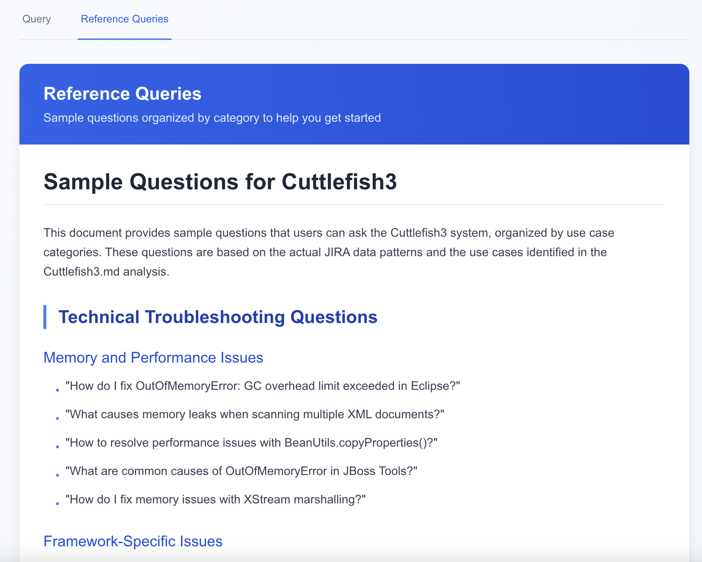

# Cuttlefish3 - JIRA RAG Query Platform

## Overview

Cuttlefish3 is a sophisticated RAG (Retrieval-Augmented Generation) platform designed for querying JIRA tickets and performing operations-related queries, particularly for incident troubleshooting. This is the third iteration of a tool that evolved from Octopus 2 (TensorFlow-based bug classification) to Cuttlefish 1 (Word2Vec + Cosine Similarity) to Cuttlefish 2 (Naive RAG).

Please view `Cuttlefish3.md` for information regarding the AIMakerspace Certification Challenge

## Problem Statement

JIRA tickets serve as organizational memory, capturing:

- Past customer problems and solutions
- Release notes and documentation
- Bug fixes and resolution methods
- Known system issues
- Historical troubleshooting knowledge

However, extracting insights from JIRA data using JQL (JIRA Query Language) is challenging, and existing Atlassian AI tools require complex workflows. Cuttlefish3 enables individual teams to build their own RAG systems for their JIRA projects without depending on IT infrastructure.

## Key Features

#### Web UI




### Multi-Agent Architecture
The system uses a LangGraph-based multi-agent approach with specialized agents:

1. **SUPERVISOR Agent** - Routes queries to appropriate agents based on:
   - Keyword search queries → BM25 Agent
   - Non-urgent queries → Ensemble Agent  
   - Production incidents → Contextual Compression Agent
   - General queries → Contextual Compression Agent

2. **BM25 Agent** - Performs keyword-based retrieval
3. **ENSEMBLE Agent** - Combines multiple retrieval methods for comprehensive results
4. **CONTEXTUALCOMPRESSION Agent** - Optimized for production incident scenarios
5. **RESPONSEWRITER Agent** - Formulates final responses considering query intent

### Use Cases

See `Cuttlefish3.md` for full list 

**Technical Troubleshooting**

- Memory leak resolution in specific technologies
- Error message interpretation and solutions
- Configuration and setup issues

**Bug Pattern Recognition**

- Common causes of specific failure types
- Historical analysis of recurring issues
- Best practices identification

**Production Incident Support**

- Root cause identification for urgent issues
- Historical incident correlation
- Rapid solution discovery

## Project Structure

```
cuttlefish3/
├── 📁 data/                          # JIRA datasets and processing scripts
│   ├── JIRA_OPEN_DATA_LARGESET_DATESHIFTED.csv
│   ├── JIRA_OPEN_DATA_LARGESET_RELEASE_TICKETS_SYNTHETIC.csv
│   ├── cuttlefish_jira_golden_dataset_*.csv
│   └── *.py                          # Data processing scripts
├── 📁 frontend/                      # Next.js web application
│   ├── src/app/                      # React components
│   ├── public/                       # Static assets
│   └── package.json                  # Dependencies
├── 📁 qdrant/                        # Vector database scripts
│   ├── upload_jira_csv_to_qdrant.py
│   ├── upload_jira_csv_to_qdrant_semantic.py
│   └── sanity-test.py
├── 📁 test/                          # Testing and diagnostics
│   ├── cuttlefish3-sanity.py        # API testing
│   ├── vectorstore_diagnostics.py    # Vector DB diagnostics
│   └── *.py                          # Various test scripts
├── 📁 references/                    # Reference implementations
│   ├── frontend/                     # Cuttlefish2 UI reference
│   └── *.ipynb                       # Reference notebooks
├── 📁 venv/                          # Python virtual environment
├── 📄 Cuttlefish3_Complete.ipynb    # Main implementation notebook
├── 📄 Cuttlefish3_RAG_Chunking_Retrieval_Evaluation.ipynb
├── 📄 Golden_Dataset_Generator_Cuttlefish.ipynb
├── 📄 entities.txt                   # Extracted technical entities
├── 📄 cuttlefish3_rag_evaluation_results.json
└── 📄 *.md                           # Documentation files
```

## Core Components

### Data Processing
- **JIRA Dataset**: 213,620 tickets with 18 columns including title, description, key, priority, status
- **Date Shifting**: Original 2003-2013 data shifted to 2014-2025 for modern relevance
- **Synthetic Data**: 2,860 PCR release tickets generated for comprehensive testing
- **Entity Extraction**: 100 most frequent technical entities identified

### RAG Evaluation
- **7 Retrieval Methods**: Naive, BM25, Multi-Query, Parent Document, Contextual Compression, Ensemble, Semantic Chunking
- **RAGAS Framework**: Comprehensive evaluation with technical faithfulness and answer relevancy metrics
- **Results**: Semantic Chunking outperforms Naive approach across 5/6 key metrics

### Vector Database
- **QDrant**: Primary vector store for JIRA ticket embeddings
- **Semantic Search**: Optimized for technical content and troubleshooting queries
- **Metadata Filtering**: Support for project, priority, status, and date filtering

### Frontend Application
- **Next.js**: Modern React-based web interface
- **Two-Tab Design**: Query interface + Reference queries display
- **Production Incident Toggle**: Special handling for urgent issues
- **Responsive Design**: Tailwind CSS styling

## Installation & Setup

### Prerequisites
- Python 3.8+
- Node.js 16+
- QDrant vector database
- OpenAI API key

### Backend Setup
```bash
# Create virtual environment
python -m venv venv
source venv/bin/activate  # On Windows: venv\Scripts\activate

# Install dependencies
pip install -r requirements.txt

# Set up QDrant
docker run -p 6333:6333 qdrant/qdrant

# Upload JIRA data to QDrant
python qdrant/upload_jira_csv_to_qdrant_semantic.py
```

### Frontend Setup
```bash
cd frontend
npm install
npm run dev
```

## Usage

### API Endpoints
- `POST /rag` - Main RAG query endpoint
- `POST /health` - Health check endpoint

### Query Parameters
- `query`: User's question about JIRA tickets
- `user_can_wait`: Boolean for non-urgent queries
- `production_incident`: Boolean for urgent production issues

### Example Queries
- "How do I fix memory leaks in Xerces-C++ when scanning multiple XML documents?"
- "What causes 'xwork does not support the VFS of jboss-6.0Final' errors?"
- "Show me all Hibernate lazy loading issues and their solutions"

## Evaluation Results

The system has been comprehensively evaluated using RAGAS framework. See `Cuttlefish3.md` for full report

## Development

### Key Notebooks
- `Cuttlefish3_Complete.ipynb`: Main implementation with Flask API
- `Cuttlefish3_RAG_Chunking_Retrieval_Evaluation.ipynb`: RAG evaluation framework
- `Golden_Dataset_Generator_Cuttlefish.ipynb`: Training data generation

### Testing
- `test/cuttlefish3-sanity.py`: API functionality testing
- `test/vectorstore_diagnostics.py`: Vector database diagnostics
- `qdrant/sanity-test.py`: QDrant connectivity testing

## Architecture

### Multi-Agent Flow
```
User Query + Flags
       ↓
SUPERVISOR Agent (Routing)
       ↓
[BM25 | ENSEMBLE | CONTEXTUALCOMPRESSION]
       ↓
RESPONSEWRITER Agent
       ↓
Formatted Response
```

### Data Flow
```
JIRA CSV → Preprocessing → Vector Embedding → QDrant Storage
                                    ↓
User Query → Multi-Agent System → RAG Retrieval → Response Generation
```

## License

TBD

## Acknowledgments

- Built on LangChain and LangGraph frameworks
- Uses QDrant for vector storage
- Evaluated with RAGAS framework
- Inspired by real-world JIRA troubleshooting needs 